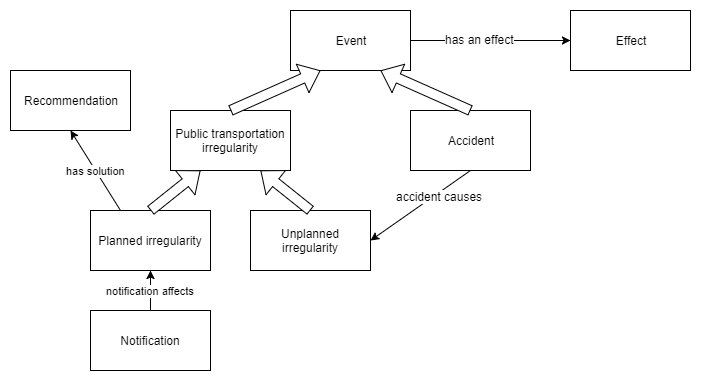
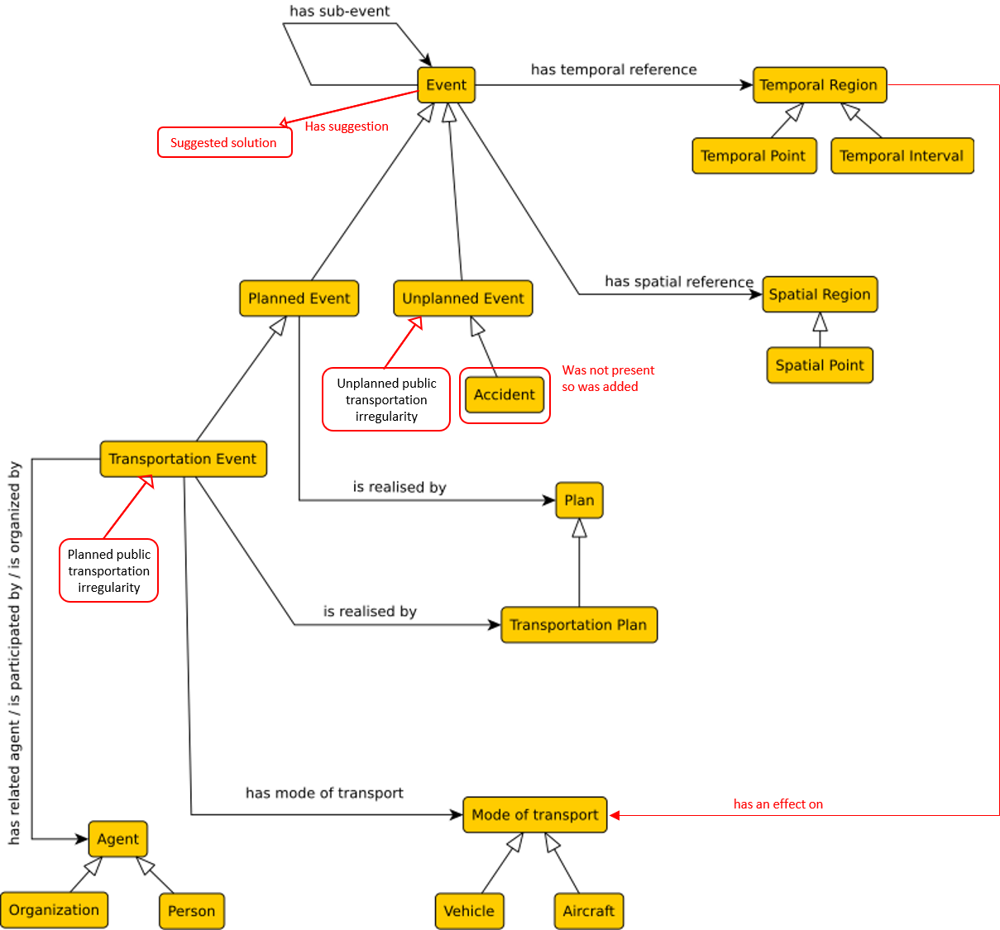

# Ontology

There are 2 ontologies presented. The first one is a stand alone version covering only data, whuc are collected at this moment. The second one is updated version of [ontology suggested by semester assignment](http://onto.fel.cvut.cz/ontologies/transportation).

## Stand alone ontology: Public transportation irregularity

Ontology suited to case of public transportation irregularities and it reasoning. 

 

## Global ontology: Transportation Ontology (TO)

Changes made to the original ontology are marked red.

